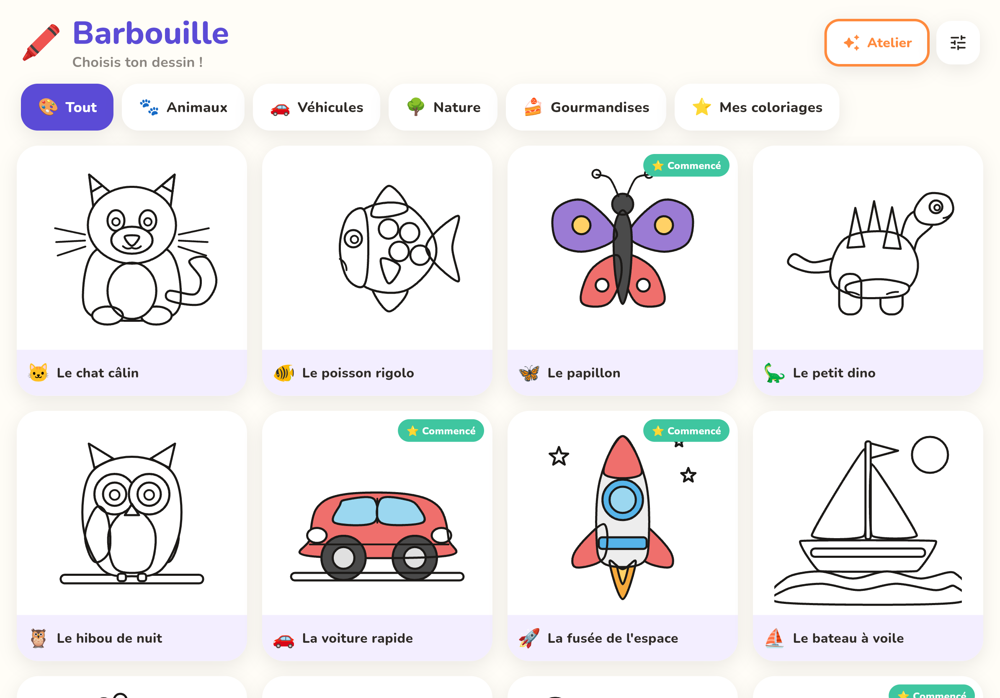
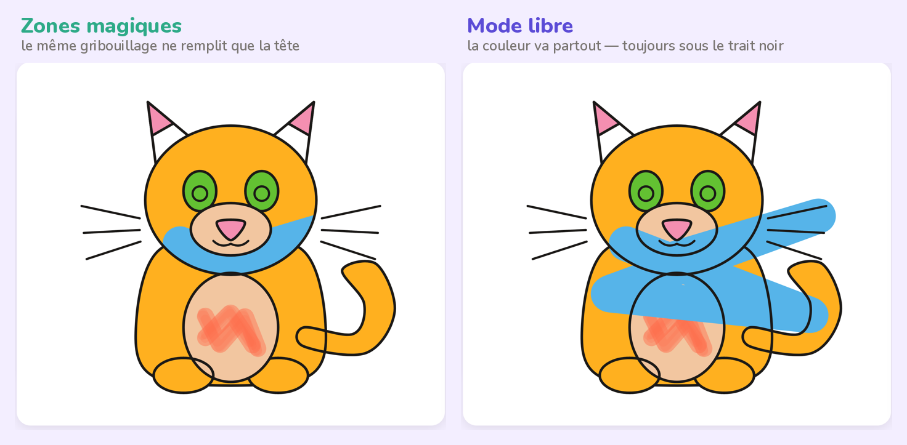
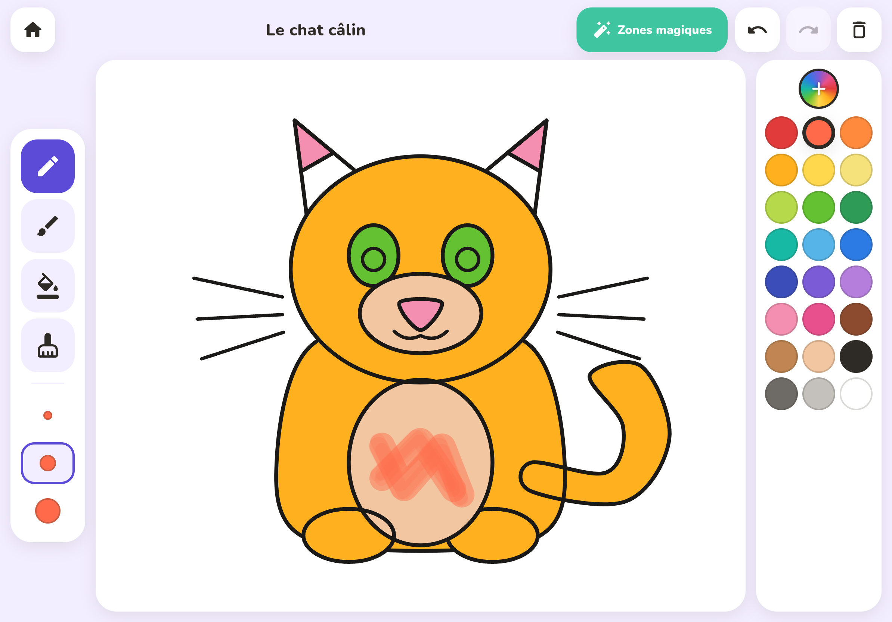
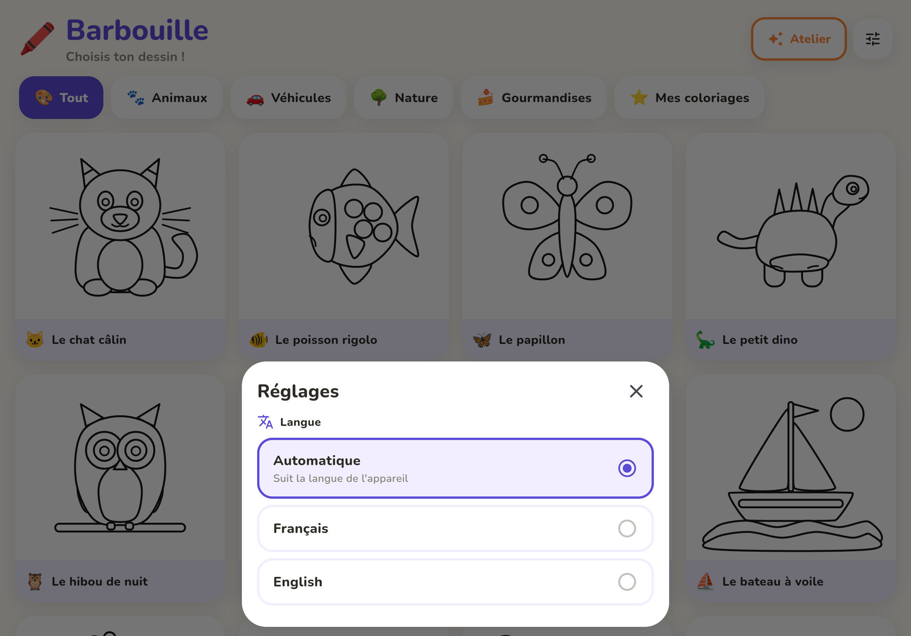
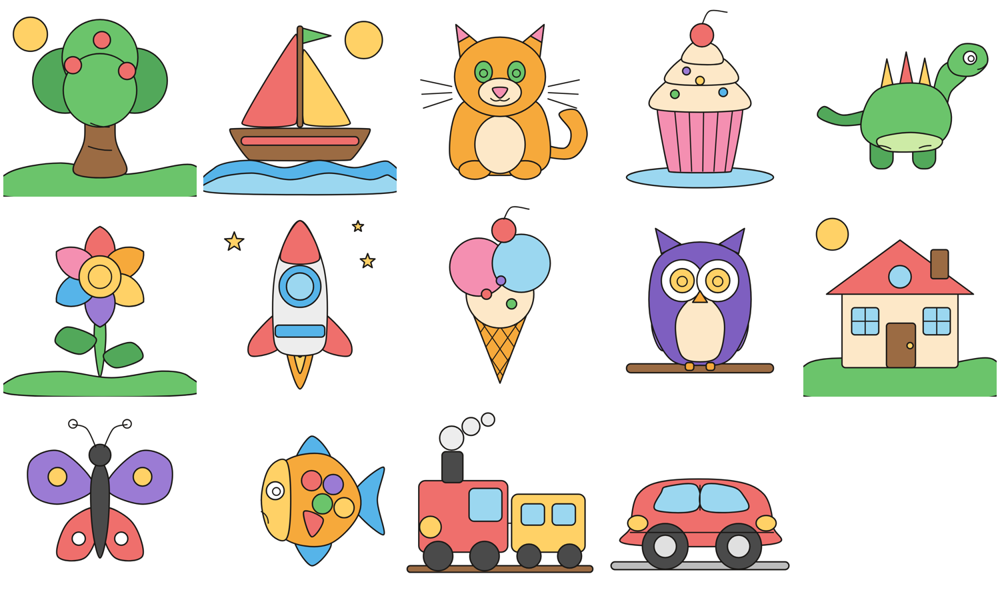

# Barbouille 🖍️

Application de coloriage pour enfants de 3 à 8 ans — **iOS et Android**,
téléphones et tablettes. Écrite en Flutter, un seul code source.

> **La spécification fonctionnelle complète est dans [`SPEC.md`](SPEC.md)** :
> décisions produit, architecture, conformité, feuille de route et chiffrage.



## Le principe

Une feuille de coloriage qui ne peut pas être ratée.

**1. On colorie toujours *sous* le trait noir.** Le contour est redessiné
par-dessus la couleur à chaque image : quoi que l'enfant barbouille, le dessin
reste net. Ce n'est pas une option, c'est le fonctionnement.

**2. Les « Zones magiques » empêchent de déborder.** Au poser du doigt, le trait
est confiné à la zone touchée jusqu'au relâcher. Activé par défaut, débrayable
d'un bouton.



## Fonctionnalités

- Galerie de **14 dessins** vectoriels classés par thème, avec reprise en cours
- **Crayon** (grain de cire), **feutre**, **pot de peinture**, **gomme** × 3 tailles
- **24 couleurs** + création de couleurs en **RVB**, mémorisées
- **Français et anglais** — interface et titres des dessins, automatique par défaut
- Annuler / refaire illimités ; « tout effacer » annulable d'un seul appui
- Sauvegarde automatique après chaque trait, reprise à l'identique
- Disposition adaptée au téléphone et à la tablette, dans toutes les orientations
- **Aucun compte, aucune publicité, aucune collecte, fonctionne hors ligne**



## Langue

Français et anglais. Par défaut l'application **suit la langue de l'appareil**&nbsp;;
le réglage vit dans l'espace parents, derrière un appui maintenu de 2 secondes.

Les **titres des dessins et les noms de catégories sont traduits** eux aussi —
« Le chat câlin » devient « The cuddly cat ». Ajouter une langue&nbsp;: une valeur
dans `AppLocale`, un paramètre nommé obligatoire de plus dans `AppStrings._t`,
puis les traductions — que l'analyseur signale une par une.



## Démarrer

```bash
cd app
flutter pub get
flutter run            # appareil ou simulateur
flutter test           # 22 tests
```

## Essayer tout de suite

**<https://kevinpy.github.io/testA/>** — déployé sur GitHub Pages à chaque
poussée. Sur iPhone, ouvrir l'adresse dans Safari puis **Partager ▸ Sur l'écran
d'accueil** : l'application se lance en plein écran, sans barre de navigateur.

## Installer sur un iPhone

Un `.ipa` non signé est construit par GitHub Actions sur un exécuteur macOS
(**Actions ▸ « iOS — .ipa non signé »**), puis signé avec votre identifiant
Apple au moment de l'installation — aucun certificat ne transite par
l'intégration continue.

Marche à suivre complète, avec ou sans Mac : **[docs/INSTALL-IPHONE.md](docs/INSTALL-IPHONE.md)**,
qui compare aussi ce que la version web sait faire et ne sait pas faire.

## Organisation du dépôt

```
app/lib/
├── l10n/       toutes les chaînes de l'interface, en français et en anglais
├── models/     description d'un dessin, opérations de coloriage, outils
├── data/       pages.g.dart — bibliothèque générée, ne pas éditer
├── state/      contrôleur d'œuvre, palette, sauvegarde, réglages
├── widgets/    peintre du canevas, barre d'outils, nuancier, modale RVB,
│               contrôle parental
├── screens/    galerie, coloriage, réglages
└── theme/      couleurs et typographie
tools/
├── shapes.py         primitives géométriques
├── build_pages.py    génère la bibliothèque de dessins
├── build_icon.py     génère l'icône, iOS et Android
├── seed.mjs          jeux de données pour les captures
└── screenshots.mjs   captures automatisées de l'application réelle
docs/screenshots/     toutes prises dans l'application, jamais des maquettes
```

## Bibliothèque de dessins

Les dessins sont **vectoriels** : chaque zone coloriable est un contour fermé.
Le pot de peinture ne peut pas fuir, le rendu reste net sur une tablette 12,9",
et un dessin pèse quelques kilo-octets.

```bash
python3 tools/build_pages.py     # 14 dessins, 155 zones → app/lib/data/pages.g.dart
```



## Regénérer les captures d'écran

Les captures sont prises dans l'application réelle, compilée pour le web et
pilotée par Playwright.

```bash
cd app && flutter build web --release --no-web-resources-cdn
(cd app/build/web && python3 -m http.server 8099 &)
node tools/screenshots.mjs
```

## Licence des ressources

Police **Nunito** — SIL Open Font License 1.1 (`app/assets/fonts/OFL.txt`).
Tous les dessins sont originaux, générés par `tools/build_pages.py`.
